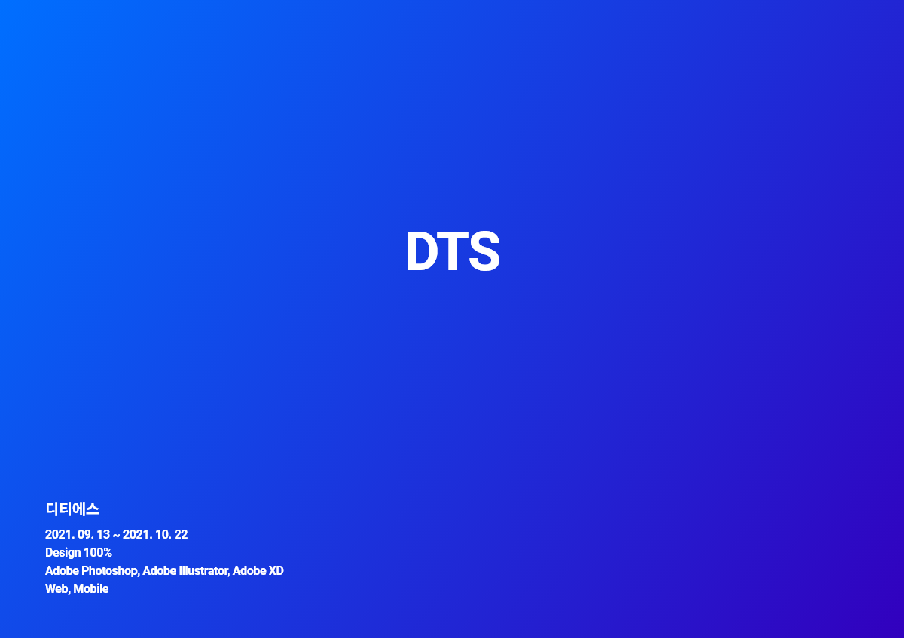
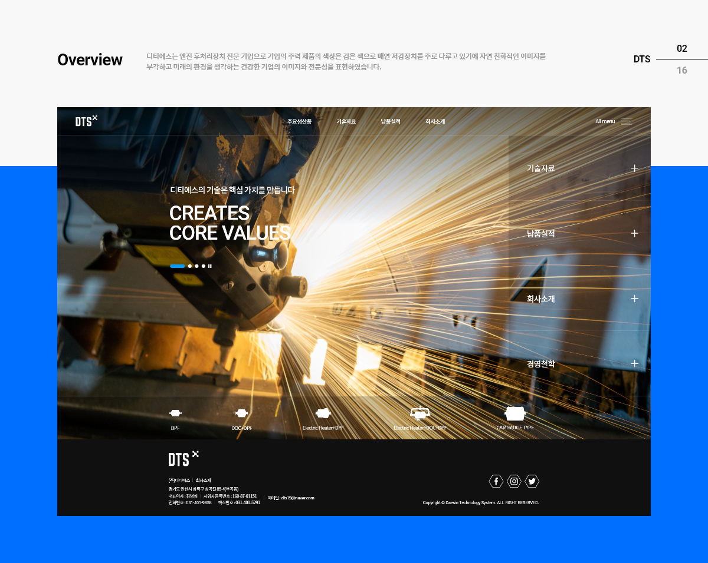
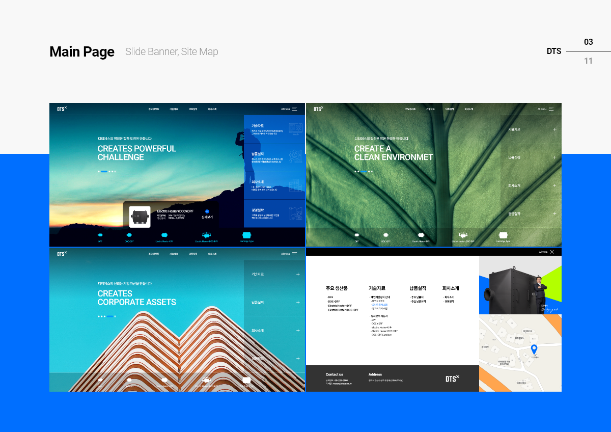
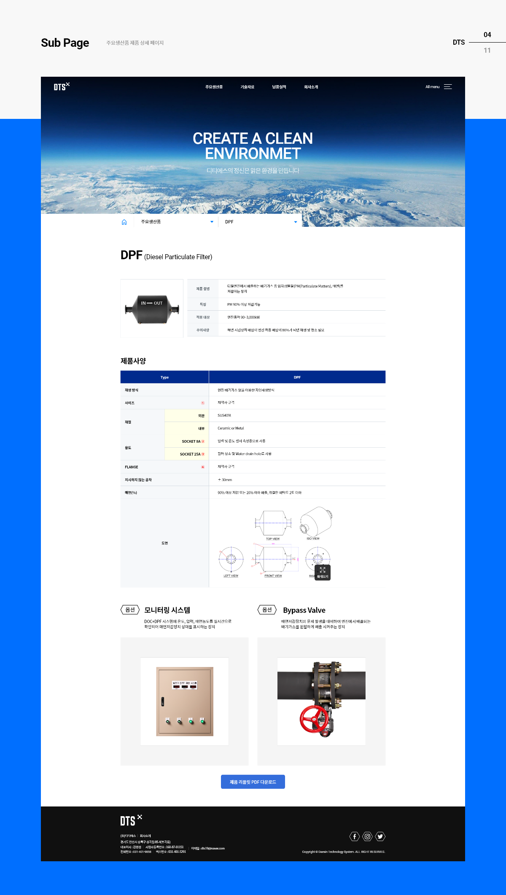
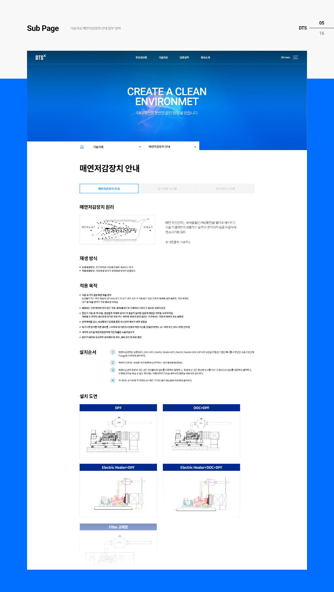
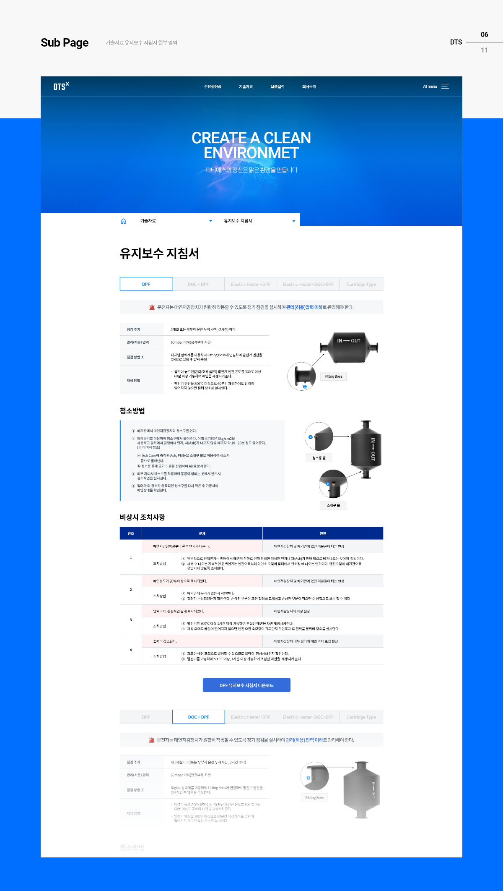
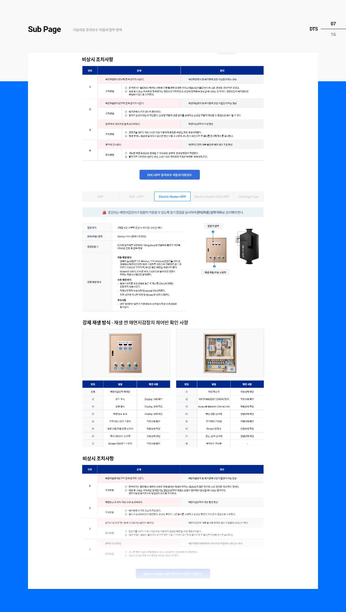
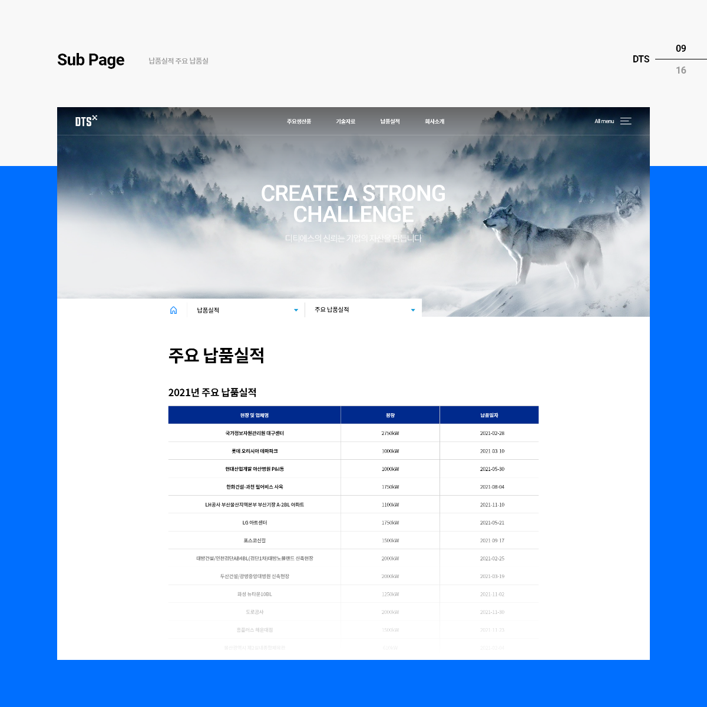
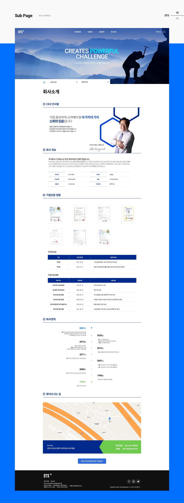
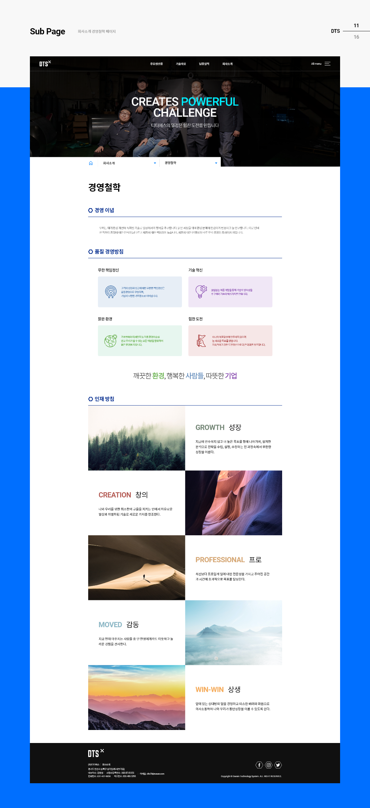

# Overview

[디티에스](http://dts19.co.kr/)는 주식회사 디티에스는 엔진 후처리장치 전문기업입니다. 오늘날 제조중소기업은 좋은 기술과 오랫 경험이 있지만 자신의 정체성과 색을 표현하는데 한계를 겪고 있습니다. 이러한 중소기업의 문제점을 해결하고 더 넓은 글로벌 시장으로 나아가기 위해 정부에서는 제조중소기업 혁신바우처사업을 하고 있습니다. [스타리치 어드바이져](http://www.starrich.co.kr/)는 사업수행 기업으로 선정되어 제작하게 되었습니다.

# 사이트 디자인

## 메인페이지

<figcaption>디자인 설명</figcaption>

<figcaption>디자인 설명</figcaption>

<figcaption>디자인 설명</figcaption>

<figcaption>디자인 설명</figcaption>

<figcaption>디자인 설명</figcaption>

<figcaption>디자인 설명</figcaption>

<figcaption>디자인 설명</figcaption>

<figcaption>디자인 설명</figcaption>

<figcaption>디자인 설명</figcaption>

<figcaption>디자인 설명</figcaption>

<figcaption>디자인 설명</figcaption>