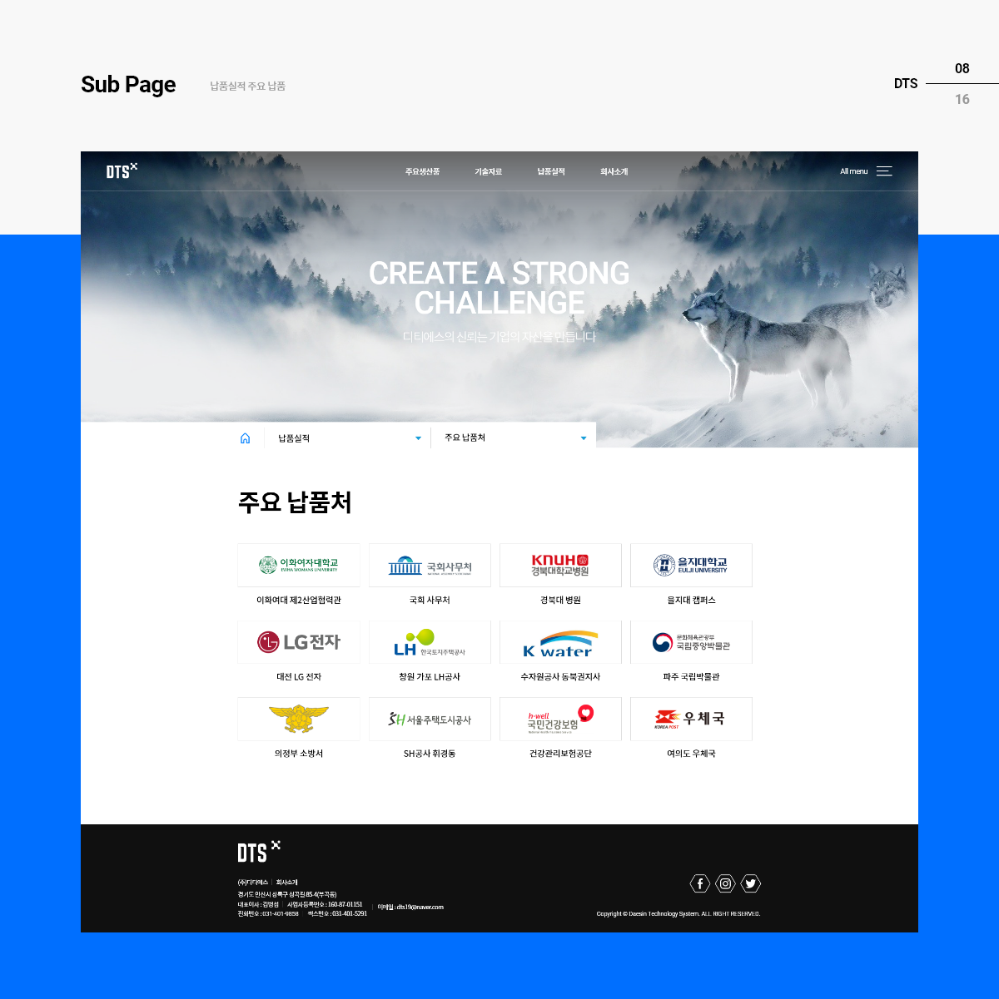
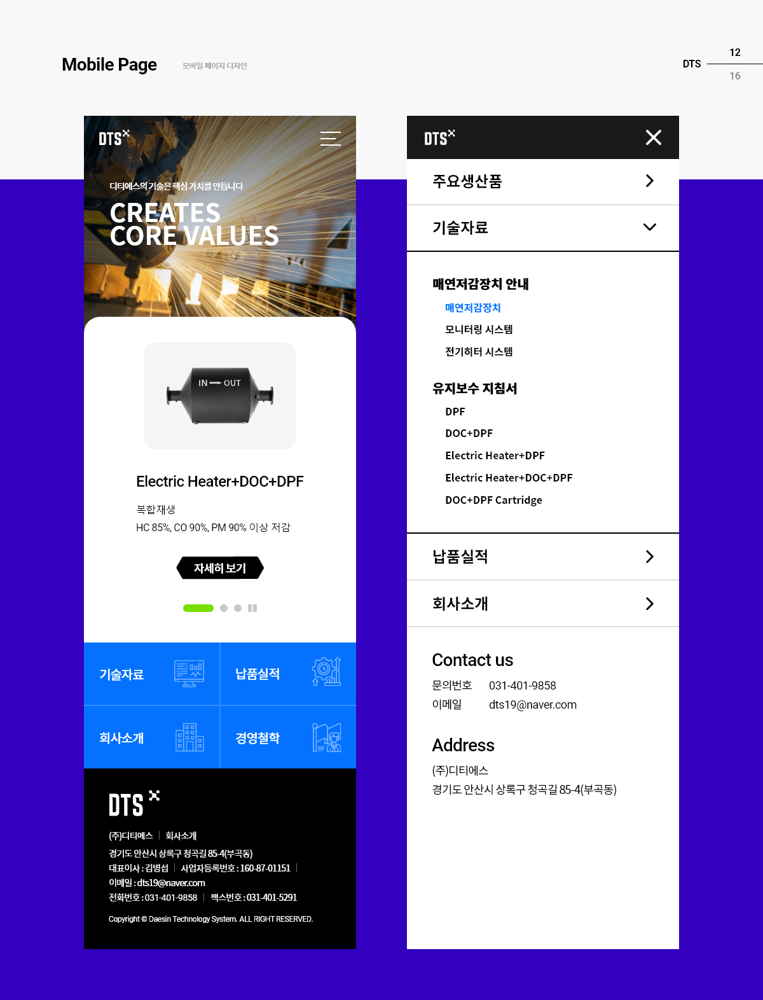
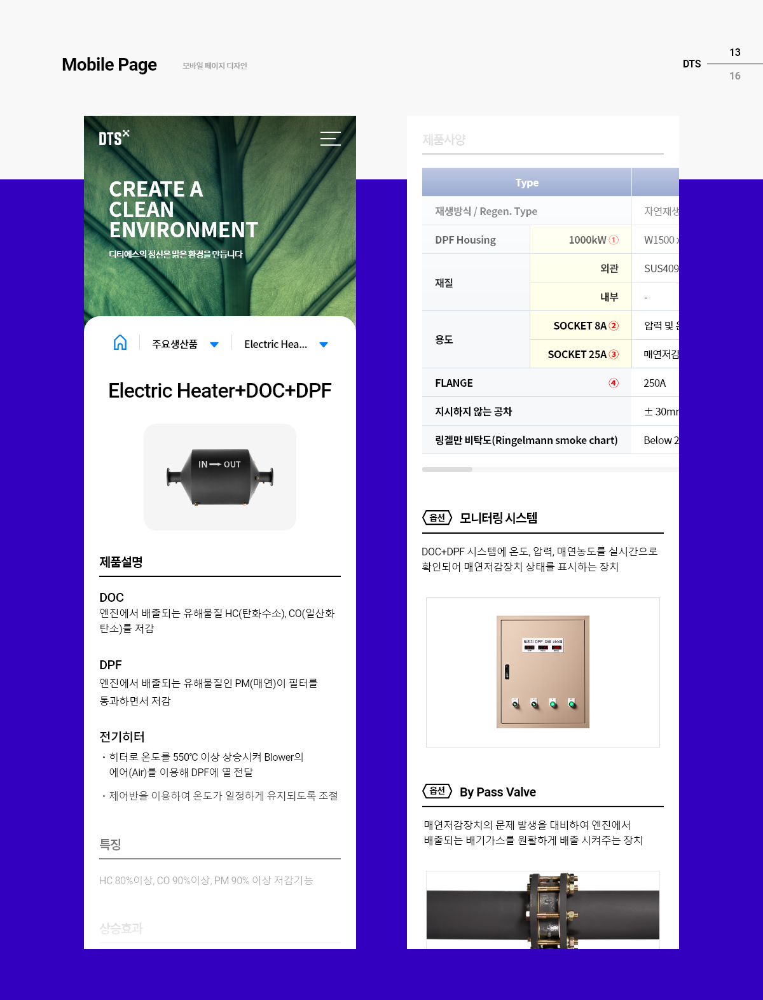
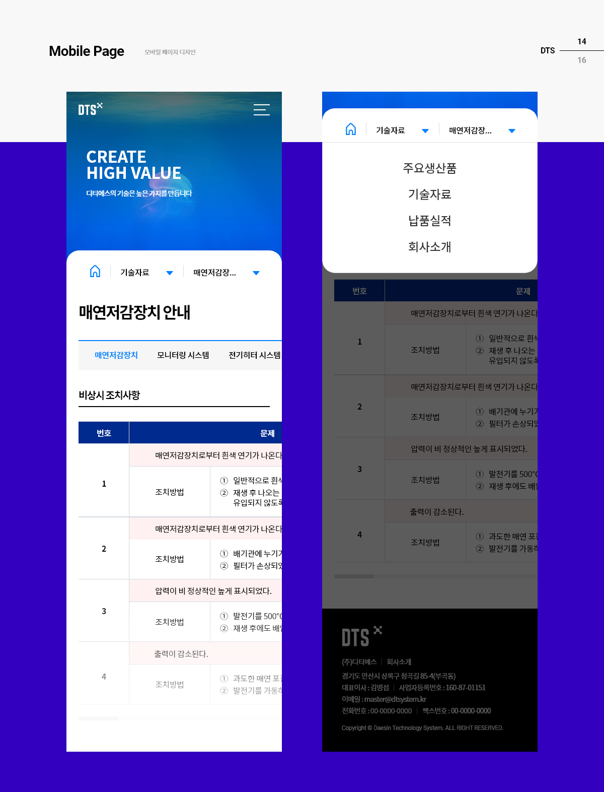
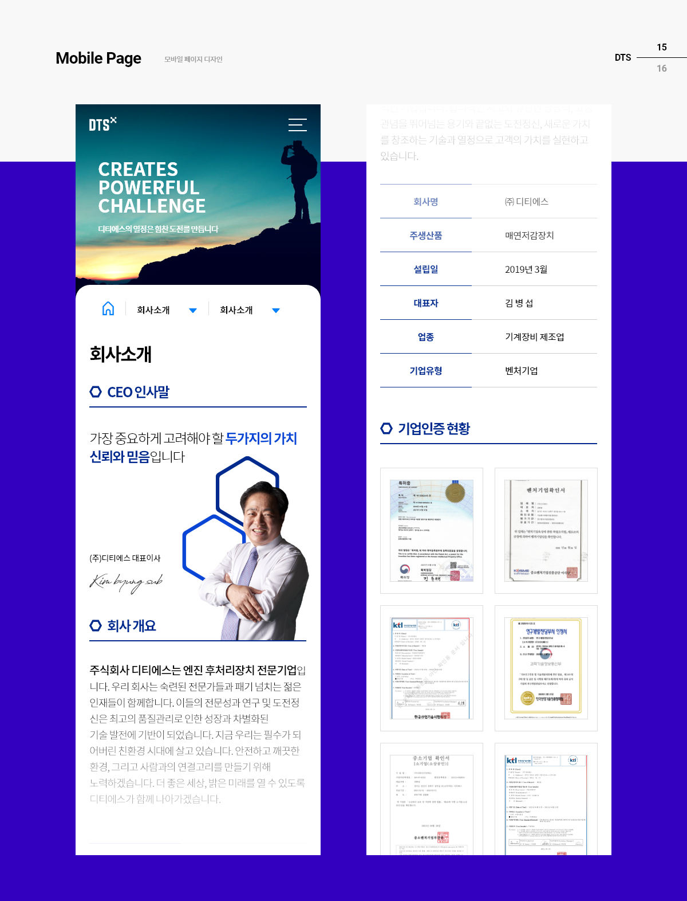
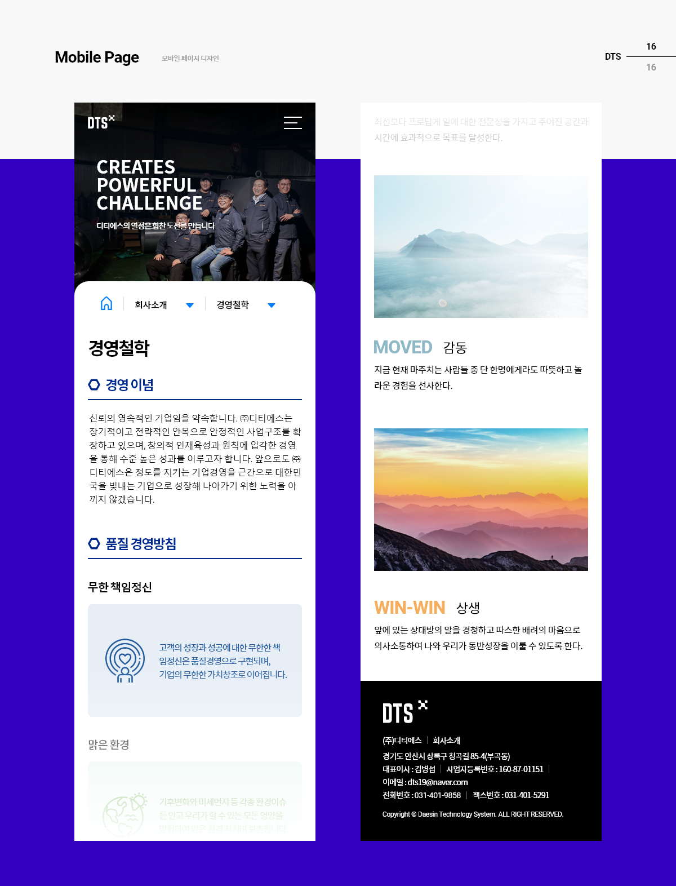

# Overview

[디티에스](http://dts19.co.kr/)는 주식회사 디티에스는 엔진 후처리장치 전문기업입니다. 오늘날 제조중소기업은 좋은 기술과 오랫 경험이 있지만 자신의 정체성과 색을 표현하는데 한계를 겪고 있습니다. 이러한 중소기업의 문제점을 해결하고 더 넓은 글로벌 시장으로 나아가기 위해 정부에서는 제조중소기업 혁신바우처사업을 하고 있습니다. [스타리치 어드바이져](http://www.starrich.co.kr/)는 사업수행 기업으로 선정되어 제작하게 되었습니다.

# 사이트 디자인

<figcaption>DTS 프로젝트 커버</figcaption>

## 데스크탑 페이지

<figcaption>디티에스는 엔진 후처리장치 전문 기업으로 기업의 주력 제품의 색상은 검은 색으로 매연 저감장치를 주로 다루고 있기에 자연 친화적인 이미지를 부각하고 미래의 환경을 생각하는 건강한 기업의 이미지와 전문성을 표현하였습니다.</figcaption>

<figcaption>메인 페이지 슬라이드 배너 및 GNB 사이트맵 화면 디자인</figcaption>

<figcaption>주요 생산품중 일부 (DPF)</figcaption>

<figcaption>매연저감장치 안내</figcaption>

<figcaption>유지보수 지침서 일부 (1/2)</figcaption>

<figcaption>유지보수 지침서 일부 (2/2)</figcaption>

<figcaption>주요 납품처</figcaption>

<figcaption>주요 납품실적</figcaption>

<figcaption>디티에스의 제품이 육각형의 형태를 하고 있어 해당 형태를 아이콘으로 표현하였습니다. 동시에 단단하고 잘 짜여진 기업의 이미지를 표현</figcaption>

<figcaption>직원들의 사진을 상단에 노출 시키고 생산 제품의 어두운 이미지를 탈피하고 부드러운 이미지를 포현하면서 환경을 생각하는 기업 이미지를 보여주려 다양한 색을 사용</figcaption>

## 모바일 페이지

<figcaption>모바일 메인과 메뉴 화면</figcaption>

<figcaption>모바일 제품 상세 페이지</figcaption>

<figcaption>모바일 매연저감장치 안내</figcaption>

<figcaption>모바일 회사소개</figcaption>

<figcaption>모바일 경영철학</figcaption>