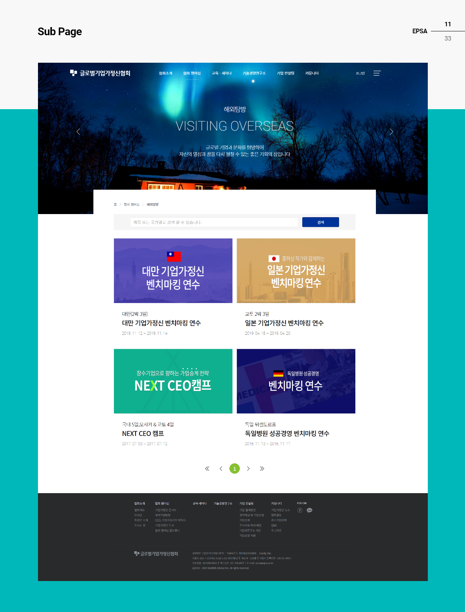
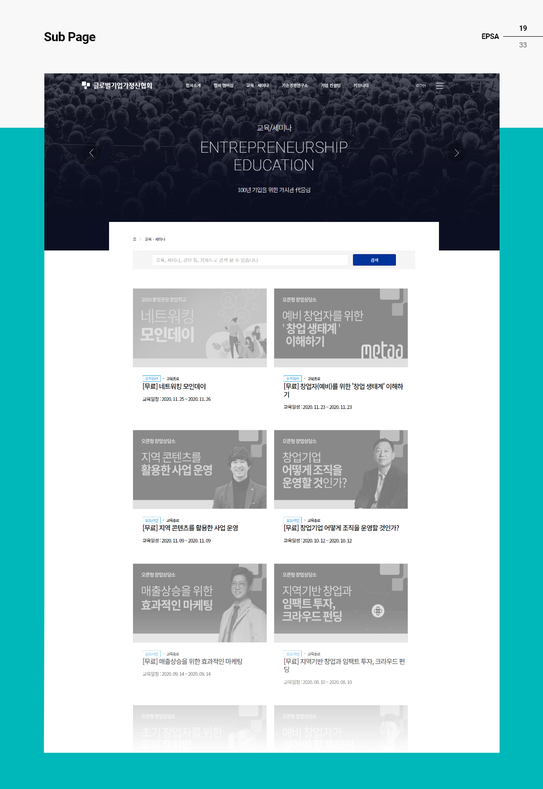
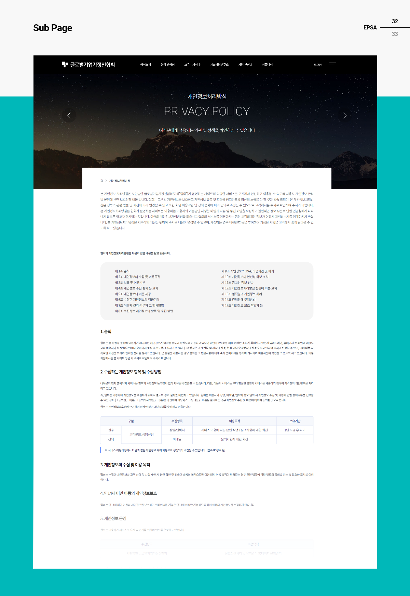

# Overview

[글로벌기업가정신협회](http://http://www.epsa.or.kr/)는 [스타리치 어드바이져](http://www.starrich.co.kr/)에서 기업가정신 콘서트를 진행하면서 쌓은 노하우를 통해 중소기업벤처기업부에서 비영리법인 설립허가(2018-22)를 받았으며, 세계적인 장수 기업이 되기 위해 기업가정신을 발굴·공유·계승하고자 설립되었습니다. 그에 필요한 정보 컨텐츠와 교육을 제공하는 목적으로 구축하게 되었습니다.

# 사이트 디자인

<figcaption>프로젝트 커버</figcaption>

## 데스크탑 페이지

<figcaption>Overview</figcaption>

<figcaption>메인 페이지 디자인</figcaption>

<figcaption>GNB UI 디자인</figcaption>

<figcaption>협회소개</figcaption>

<figcaption>인사말</figcaption>

<figcaption>회장단 소개</figcaption>

<figcaption>오시는 길</figcaption>

<figcaption>기업가정신 콘서트 리스트</figcaption>

<figcaption>기업가정신 콘서트 상세</figcaption>

<figcaption>해외 탐방 리스트</figcaption>

<figcaption>해외 탐방 상세</figcaption>

<figcaption>CEO, 기업가정신을 말하다 리스트</figcaption>

<figcaption>CEO, 기업가정신을 말하다 상세</figcaption>

<figcaption>기업가정신 도서 리스트</figcaption>

<figcaption>기업가정신 도서 상세</figcaption>

<figcaption>협회 멤버십 골프행사 상세</figcaption>

<figcaption>협회 멤버십 골프행사 상세</figcaption>

<figcaption>교육/세미나</figcaption>

<figcaption>교육/세미나 상세</figcaption>

<figcaption>기술경영연구소</figcaption>

<figcaption>기업 컨설팅</figcaption>

<figcaption>기업가정신 뉴스</figcaption>

<figcaption>기업가정신 뉴스 상세</figcaption>

<figcaption>협회활동</figcaption>

<figcaption>협회활동 상세</figcaption>

<figcaption>중소벤처기업부 정책 아카이브</figcaption>

<figcaption>중소벤처기업부 정책 아카이브 상세</figcaption>

<figcaption>Q & A</figcaption>

<figcaption>로그인</figcaption>

<figcaption>회원가입</figcaption>

<figcaption>개인정보처리방침</figcaption>

<figcaption>이용약관</figcaption>

## 기타 추가 페이지

<figcaption>기업가정신콘서트 신청페이지</figcaption>

<figcaption>교육&세미나 마이페이지</figcaption>

<figcaption>세계 기업가 기념일 리스트 페이지</figcaption>

<figcaption>세계 기업가 기념일 상세 페이지</figcaption>

<figcaption>리더십 교육관련 상세 페이지 : 결제 옵션</figcaption>

![도서 미리보기 팝업]](img/page39-20191231-epsa.png)

<figcaption>도서 미리보기 팝업</figcaption>
